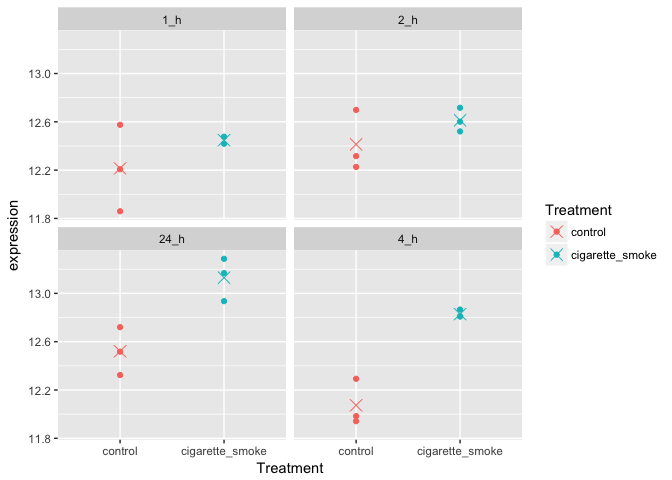
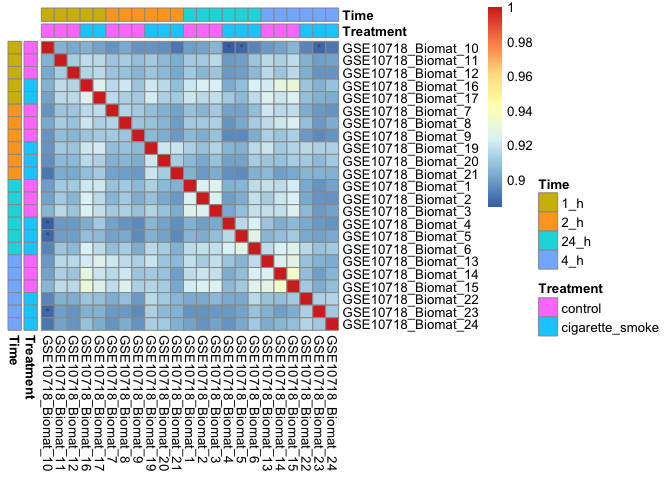
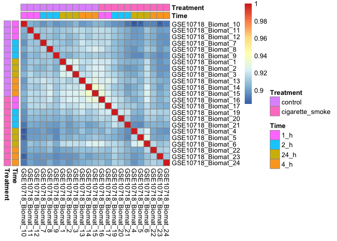
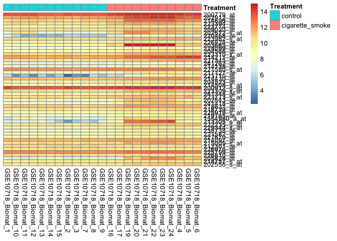
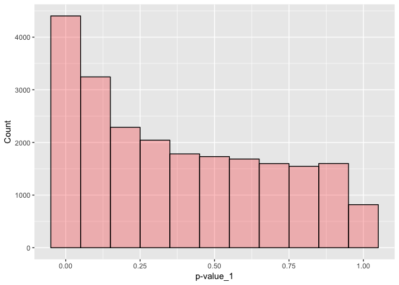
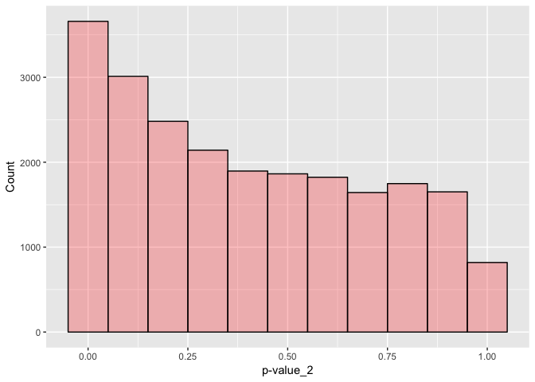
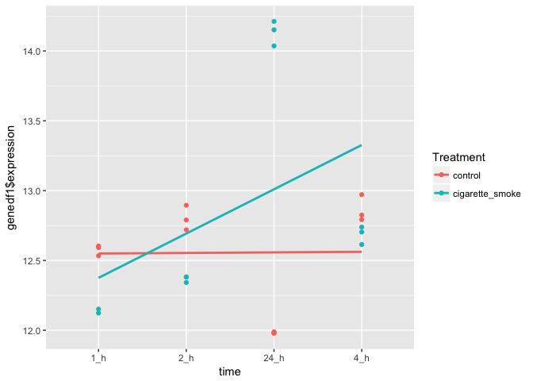
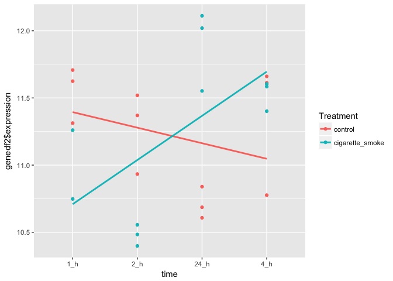
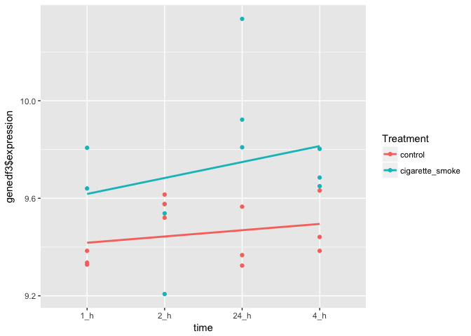
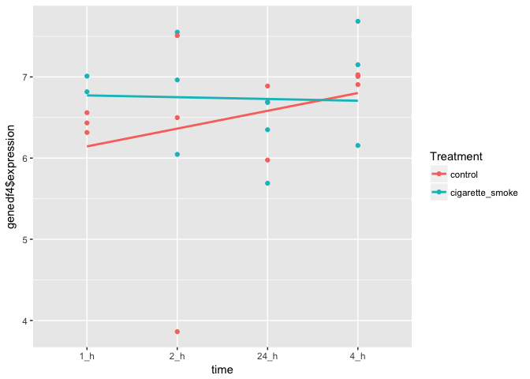

# 540 Assignment I
Fangwu Wang  
2017-03-02  


## Q1. Data inspection

####1.1 Download and inspect the data
Load data:

```r
setwd("/Users/fangwu/Documents/R-git/zz_wang-fangwu_STAT540_2017/Analysis assignment")
# open the downloaded data
data<-read.delim(file="data.txt") 
metadata<-read.delim(file="NHBE_design.txt")
# check the factor levels
levels(metadata$Treatment) 
```

```
## [1] "cigarette_smoke" "control"
```

```r
levels(metadata$time)
```

```
## [1] "1_h"  "2_h"  "24_h" "4_h"
```

```r
# reorder the level of Treatment to put the control group first
metadata$Treatment<-relevel(metadata$Treatment,ref = "control") 
```


```r
str(data,max.level=0)
```

```
## 'data.frame':	22737 obs. of  23 variables:
```
There are 22737 genes and 23 samples in the data.

```r
# breakdown for treatment and time
with(metadata,table(metadata$Treatment,metadata$time))
```

```
##                  
##                   1_h 2_h 24_h 4_h
##   control           3   3    3   3
##   cigarette_smoke   2   3    3   3
```
There are three replicates for each timepoint of each treatment condition, except for one condition (cigarette at 1h) which may compromise the statistical power for its comparison with any other conditions. Overall the data is balanced and meaningful statistical inference could be generated from it.

####1.2 Basic data manipulation
Generate a numeric vector for time:

```r
time_num<-factor(metadata$time,labels = c("1","2","24","4"))
time_num<-paste(time_num)
time_num<-as.numeric(time_num)
metadata<-data.frame(metadata,time_num)
head(metadata)
```

```
##                    ExternalID Treatment time time_num
## GSE10718_Biomat_1   GSM270883   control 24_h       24
## GSE10718_Biomat_10  GSM270874   control  1_h        1
## GSE10718_Biomat_11  GSM270873   control  1_h        1
## GSE10718_Biomat_12  GSM270872   control  1_h        1
## GSE10718_Biomat_13  GSM270881   control  4_h        4
## GSE10718_Biomat_14  GSM270880   control  4_h        4
```
####1.3 Basic graphing

```r
# take a random probe
rand_pro<-sample(rownames(data),1)
rd<-data[which(rownames(data)==rand_pro),]
expression<-as.numeric(rd[1,])
# combine the expression values and the metadata dataframe into a new dataframe - rddf
rddf<-data.frame(metadata,expression)
# plot with panels separated by time and colors separated by treatment
ggplot(rddf, aes(x=Treatment,y=expression,color=Treatment)) + geom_point() +facet_wrap(~time) + stat_summary(fun.y = mean, geom = "point", shape = 4, size = 4)
```

<!-- -->

## Q2. Assessing data quality
####2.1 Examine the sample-to-sample correlations in a heatmap
Create a correlation matrix, using pearson correlation between each pair of samples:

```r
c<-cor(data, y = NULL, use = "everything",method = c("pearson"))
```
Order the samples by time; within each time group, sort on treatment:

```r
# order the matrix
order_time<-c[order(metadata$time,metadata$Treatment),]
order_time<-order_time[,order(metadata$time,metadata$Treatment)]
# annotate the heatmap
anno_time <- data.frame(Name=rownames(metadata),Treatment = metadata$Treatment,Time = metadata$time)
anno_time<-anno_time[order(anno_time$Time,anno_time$Treatment),]
row.names(anno_time)<-anno_time[,1]
anno_time<-anno_time[,2:3]
# make a heatmap
pheatmap(mat=order_time,scale="none",cluster_cols = F, cluster_rows = F,annotation_col = anno_time,annotation_row = anno_time,display_numbers = matrix(ifelse(order_time < 0.89, "*", ""), nrow(order_time)))
```

<!-- -->

Order the samples by treatment; within each time group, sort on time:

```r
order_treat<-c[order(metadata$Treatment,metadata$time),]
order_treat<-order_treat[,order(metadata$Treatment,metadata$time)]
anno_treat <- data.frame(Name=rownames(metadata),Time = metadata$time,Treatment = metadata$Treatment)
anno_treat<-anno_treat[order(anno_treat$Treatment,anno_treat$Time),]
row.names(anno_treat)<-anno_treat[,1]
anno_treat<-anno_treat[,2:3]
pheatmap(mat=order_treat,scale="none",cluster_cols = F, cluster_rows = F,annotation_col = anno_treat,annotation_row = anno_treat,display_numbers = matrix(ifelse(order_treat < 0.89, "*", ""), nrow(order_treat)))
```

<!-- -->

####2.2 Assess the presence of outlier samples
1). Eyeballing: A correlation below 0.89 is marked as * in the two heatmaps. Highlighted values are only observed from sample GSE10718_Biomat_10 with other samples.
2).calculate the mean of the correlation coefficient across all the samples:

```r
cormean<-colMeans(c)
which.min(cormean)
```

```
## GSE10718_Biomat_10 
##                  2
```

```r
cormin<-c[which.min(cormean)]
cormin
```

```
## [1] 0.8997255
```
In agreement with the heatmap, GSE10718_Biomat_10 has the lowest correlation coefficient with all other samples and might be an outlier.
3). GSE10718_Biomat_10 has lower correlation with samples from different treatment and different time points (GSE10718_Biomat_4,5,23), while it has relatively high correlation with samples from the same treatment condition (GSE10718_Biomat_3,11,15).

## Q3. Differential expression with respect to treatment
####3.1 Linear model

```r
# fit in a linear model with treatment as a single covariate
DesMat <- model.matrix(~ Treatment,data=metadata)
DataFit <- lmFit(data, DesMat)
EbFit<-eBayes(DataFit)
DesMat
```

```
##                    (Intercept) Treatmentcigarette_smoke
## GSE10718_Biomat_1            1                        0
## GSE10718_Biomat_10           1                        0
## GSE10718_Biomat_11           1                        0
## GSE10718_Biomat_12           1                        0
## GSE10718_Biomat_13           1                        0
## GSE10718_Biomat_14           1                        0
## GSE10718_Biomat_15           1                        0
## GSE10718_Biomat_16           1                        1
## GSE10718_Biomat_17           1                        1
## GSE10718_Biomat_19           1                        1
## GSE10718_Biomat_2            1                        0
## GSE10718_Biomat_20           1                        1
## GSE10718_Biomat_21           1                        1
## GSE10718_Biomat_22           1                        1
## GSE10718_Biomat_23           1                        1
## GSE10718_Biomat_24           1                        1
## GSE10718_Biomat_3            1                        0
## GSE10718_Biomat_4            1                        1
## GSE10718_Biomat_5            1                        1
## GSE10718_Biomat_6            1                        1
## GSE10718_Biomat_7            1                        0
## GSE10718_Biomat_8            1                        0
## GSE10718_Biomat_9            1                        0
## attr(,"assign")
## [1] 0 1
## attr(,"contrasts")
## attr(,"contrasts")$Treatment
## [1] "contr.treatment"
```
In this question, I am using the linear regression model to compare different groups of samples to test whether different groups are generated by different underlying distributions. The linear model assumes the “groups” generate linear structure for quantitative predictors. The equation is Y=μ+ε, where μ represents the mean and ε represents variability around its mean. t-test statistic is used to test whether the null hypothesis (H: μ1 -μ2 = 0) is true or should be discarded. Data will be fitted into the Y = Xα + ε equation, where X is the design matrix and α is a column vector of the parameters. Intercept could be included in the model by using design matrix. In this question, I am doing two group comparison and there are two parameters, an intercept which is the expression level of the control group and the difference between the control and the treatment group, as manifested by the design matrix.

####3.2 Look at the hits

```r
toptable(EbFit,coef=2)
```

```
##                 logFC        t      P.Value    adj.P.Val        B
## 200779_at   0.7613410 8.577428 1.419183e-08 0.0001750755 9.623149
## 202912_at   1.7199499 8.161121 3.365296e-08 0.0001750755 8.840436
## 214696_at   1.9074941 8.155234 3.407195e-08 0.0001750755 8.829176
## 223394_at   1.2644771 8.147206 3.465212e-08 0.0001750755 8.813808
## 223774_at   1.1696606 8.080341 3.989741e-08 0.0001750755 8.685431
## 209020_at   1.0223766 7.939997 5.373691e-08 0.0001750755 8.413709
## 202672_s_at 3.5302487 7.904577 5.795528e-08 0.0001750755 8.344646
## 220468_at   2.4132680 7.876047 6.160022e-08 0.0001750755 8.288875
## 223982_s_at 0.9256205 7.729633 8.438527e-08 0.0001933190 8.000666
## 226924_at   0.6366539 7.726141 8.502396e-08 0.0001933190 7.993752
```

```r
tableEbFIt<-toptable(EbFit,coef=2,number=Inf)
```
hits associated with treatment at unadjusted p-value 1e-3:

```r
length(tableEbFIt[tableEbFIt[,3]<0.001,3])
```

```
## [1] 805
```
hits associated with treatment at FDR 0.05

```r
length(tableEbFIt[tableEbFIt[,4]<0.05,4])
```

```
## [1] 1238
```
Take the top 50 probes as your “hits” and create a heatmap of their expression levels. Sort the hits by p-values and the samples by treatment.

```r
# make a dataframe with the top 50 hits from the toptable
top50<-tableEbFIt[2:50,]
top50list<-rownames(top50)
topexpr<-data[rownames(data)=="200779_at",]
 for(i in top50list){
   addrow<-data[rownames(data)==i,]
   addrow<-as.numeric(addrow)
   topexpr<-rbind(topexpr,addrow)
 }
top50_2<-tableEbFIt[1:50,]
row.names(topexpr)<-rownames(top50_2)
# order the samples based on p-value and treatment
topexpr<-topexpr[order(top50_2[,3],decreasing=F),order(metadata$Treatment)]
# make a heatmap
anno_top<-data.frame(Name=rownames(metadata),Treatment=metadata$Treatment)
anno_top<-anno_top[order(anno_top$Treatment),]
rownames(anno_top)<-anno_top[,1]
anno_top<-anno_top[-c(1)]
pheatmap(mat=topexpr,scale = "none",cluster_rows = F,cluster_cols = F,annotation_col = anno_top)
```

<!-- -->

FDR in this hit list:

```r
# the biggest FDR in this list:
maxfdr<-top50_2[which.max(top50_2[,4]),4]
maxfdr
```

```
## [1] 0.001035992
```

```r
# the number of false discoveries within this list:
numfdr<-maxfdr*50
numfdr
```

```
## [1] 0.05179962
```
Therefore, there is likely to be no false discoveries in this list.

#### Q4. Differential expression with respect to time
####4.1 Linear model
Fit a linear model for assessing the effect of time on gene expression

```r
DesMat2 <- model.matrix(~ time_num,data=metadata)
DataFit2 <- lmFit(data, DesMat2)
EbFit2<-eBayes(DataFit2)
```
hits associated with time at unadjusted p-value 1e-3:

```r
toptable(EbFit2,coef=2)
```

```
##                   logFC          t      P.Value    adj.P.Val        B
## 202586_at   -0.04321190 -11.559699 5.595299e-11 1.272203e-06 15.28331
## 203201_at   -0.04242793 -10.121063 7.109181e-10 6.663751e-06 12.74567
## 227559_at   -0.05501598  -9.958972 9.609875e-10 6.663751e-06 12.44384
## 202769_at    0.04317888   9.769107 1.373425e-09 6.663751e-06 12.08602
## 226775_at   -0.03828553  -9.734894 1.465398e-09 6.663751e-06 12.02105
## 213113_s_at -0.04650788  -9.412004 2.721027e-09 1.031133e-05 11.40035
## 202770_s_at  0.03591883   9.272069 3.572582e-09 1.160426e-05 11.12709
## 226226_at    0.04323136   9.139895 4.630899e-09 1.316159e-05 10.86660
## 202887_s_at  0.04197944   8.972788 6.449452e-09 1.629347e-05 10.53391
## 200810_s_at -0.03436033  -8.828058 8.617559e-09 1.674623e-05 10.24274
```

```r
table_time<-toptable(EbFit2,coef=2,number=Inf)
length(table_time[table_time[,3]<0.001,3])
```

```
## [1] 958
```
hits associated with time at FDR 0.05:

```r
length(table_time[table_time[,4]<0.05,4]) 
```

```
## [1] 1451
```
 
## Q5. Differential expression analysis with a full model
Using both treatment and time as covariates in the full model.

```r
DesMat3 <- model.matrix(~ Treatment*time_num, data=metadata)
DataFit3 <- lmFit(data, DesMat3)
EbFit3<-eBayes(DataFit3)
```
####5.1 Quantify the number of hits for treatment
For how many probes is treatment a significant factor at the unadjusted p-value 1e-3, and at FDR 0.05 level?

```r
toptable(EbFit3,coef=2)
```

```
##                   logFC         t      P.Value    adj.P.Val        B
## 200912_s_at   0.9042074  8.377100 4.665235e-08 0.0004202951 8.478163
## 220468_at     3.0272368  8.349103 4.923043e-08 0.0004202951 8.430397
## 1555411_a_at  1.5822496  8.287320 5.545521e-08 0.0004202951 8.324553
## 220046_s_at   1.5740991  8.055196 8.713100e-08 0.0004351844 7.921528
## 219998_at    -0.7787192 -8.007462 9.569961e-08 0.0004351844 7.837597
## 223394_at     1.4579813  7.716098 1.707786e-07 0.0006471653 7.317458
## 200779_at     0.8574998  7.543462 2.419893e-07 0.0006547222 7.002910
## 214949_at    -0.5025333 -7.512502 2.577063e-07 0.0006547222 6.946000
## 203665_at     5.1742053  7.509739 2.591591e-07 0.0006547222 6.940914
## 228098_s_at   1.9396711  7.308486 3.913942e-07 0.0008899130 6.567173
```

```r
tabletreat<-toptable(DataFit3,coef=3,number=Inf)
# hits at the unadjusted p-value 1e-3
length(tabletreat[tabletreat[,3]<0.001,3])
```

```
## [1] 620
```

```r
# hits at FDR 0.05
length(tabletreat[tabletreat[,4]<0.05,4])
```

```
## [1] 790
```
Compare with the number of hits at p-value of 1e-3 from Q3:
In Q3, when treatment is the single covariate, the number of hits with p-value below 1e-3 is 805, while in the full model the number of hits is 620.   
It might be because that the total variation is contributed from treatment, time, and the treatment:time interaction, generating smaller contrast between the treatment groups.

Quantify the proportion of overlapping probes among your hits, when using the unadjusted p-value threshold of 1e-3.


```r
hit1<-tableEbFIt[tableEbFIt$P.Value<0.001,]
hit2<-tabletreat[tabletreat$P.Value<0.001,]
hit1_name<-rownames(hit1)
hit2_name<-rownames(hit2)
intersect(hit1_name,hit2_name)
```

```
##  [1] "219998_at"   "213480_at"   "223349_s_at" "222408_s_at" "213240_s_at"
##  [6] "203797_at"   "202575_at"   "227697_at"   "206055_s_at" "213476_x_at"
## [11] "226847_at"
```
There are 11 hits overlapped between the two models.   

Plot the distributions of all the p-values for treatment:

```r
pval1<-tableEbFIt[,3]
pval2<-tabletreat[,3]
ggplot() + 
  geom_histogram(aes(x = pval1), binwidth=0.1, linetype=1, alpha=.25, color="black", fill="red") +
  scale_y_continuous(name="Count") + 
  scale_x_continuous(name="p-value_1")
```

<!-- -->

```r
ggplot() + 
  geom_histogram(aes(x = pval2), binwidth=0.1, linetype=1, alpha=.25, color="black", fill="red") +
  scale_y_continuous(name="Count") + 
  scale_x_continuous(name="p-value_2")
```

<!-- -->

Both of the distribution histograms skew to the right, indicating there is a true difference between the two treatment groups, since P-values are uniformly distributed when the null hypothesis (H0) is true. There is slight difference between the two models. There are more probes with low p-values (0-0.1) from the first model (treatment as the single covariate) which is in agreement with the observation of the number of hits from the two models.

####5.2 Test the null hypothesis
Null hypothesis: there's no significant interaction between time and treatment.  

Using this interaction term, I am modelling the interaction between the effect of cigarette treatment and the effect of time on gene expression, i.e., whether the genes change differently with time in the treated group and the untreated group.


```r
interact<-toptable(EbFit3,coef=4,number = Inf)
# hits of interaction at p-value 1e-3
length(interact[interact[,3]<0.001,3])
```

```
## [1] 573
```

```r
# hits of interaction at FDR 0.05
length(interact[interact[,4]<0.05,4])
```

```
## [1] 664
```

####5.3 Plot a few probes where the interaction does and does not matter  
####The genes with interaction:

```r
# take top gene in the interaction list
gene1<-data[which(rownames(data)==rownames(interact[1,])),]
expression1<-as.numeric(gene1[1,])
genedf1<-data.frame(metadata,expression1)
ggplot(genedf1, aes(x=time,y=genedf1$expression,color=Treatment)) + geom_point() + geom_smooth(aes(group = Treatment), method = "lm", se = FALSE)
```

<!-- -->


```r
# take the rank 250 gene in the interaction list
gene2<-data[which(rownames(data)==rownames(interact[250,])),]
expression2<-as.numeric(gene2[1,])
genedf2<-data.frame(metadata,expression2)
ggplot(genedf2, aes(x=time,y=genedf2$expression,color=Treatment,ylab="Gene2 expression")) + geom_point() + geom_smooth(aes(group = Treatment), method = "lm", se = FALSE)
```

<!-- -->

####The genes without interaction:

```r
# take the rank 2000 gene in the interaction list
gene3<-data[which(rownames(data)==rownames(interact[2000,])),]
expression3<-as.numeric(gene3[1,])
genedf3<-data.frame(metadata,expression3)
ggplot(genedf3, aes(x=time,y=genedf3$expression,color=Treatment)) + geom_point() + geom_smooth(aes(group = Treatment), method = "lm", se = FALSE)
```

<!-- -->


```r
# take the rank 10000 gene in the interaction list
gene4<-data[which(rownames(data)==rownames(interact[10000,])),]
expression4<-as.numeric(gene4[1,])
genedf4<-data.frame(metadata,expression4)
ggplot(genedf4, aes(x=time,y=genedf4$expression,color=Treatment)) + geom_point() + geom_smooth(aes(group = Treatment), method = "lm", se = FALSE)
```

<!-- -->

