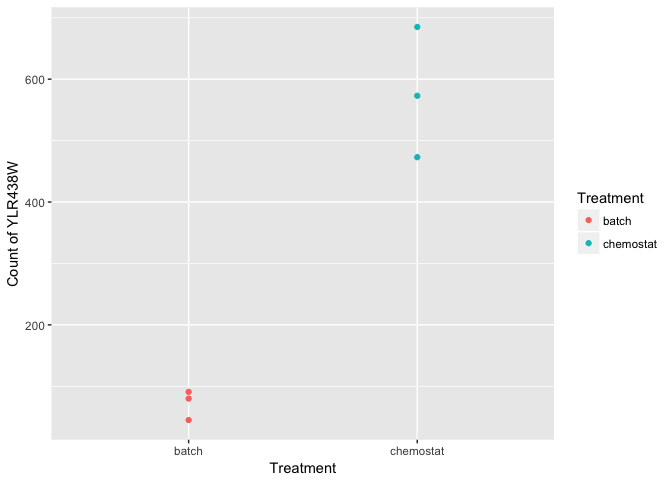
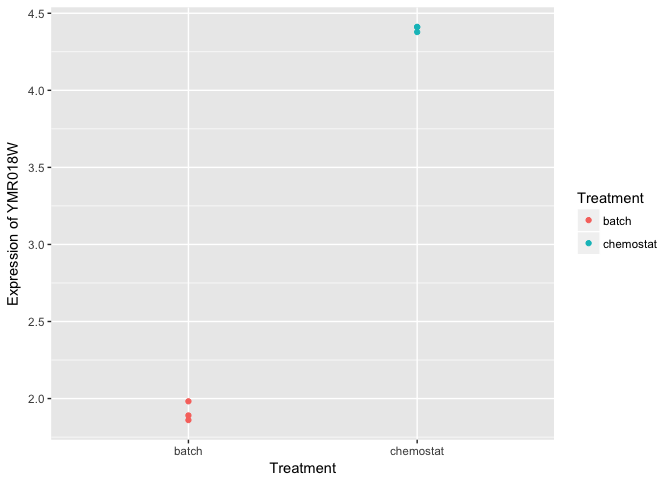
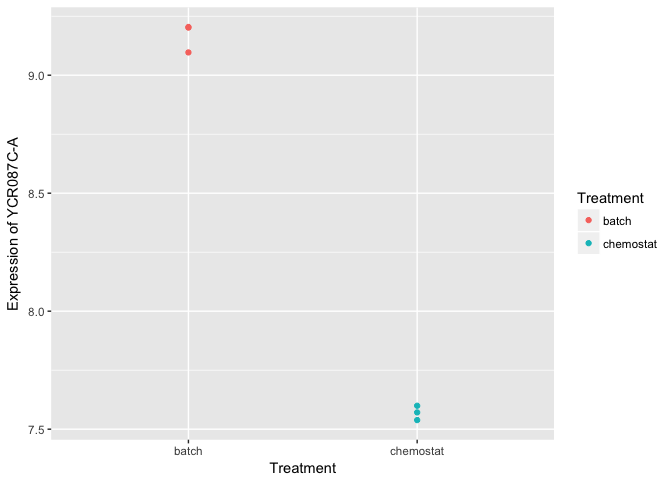
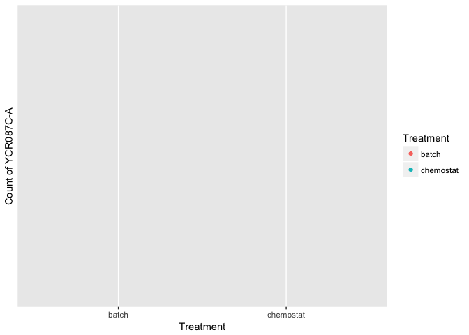
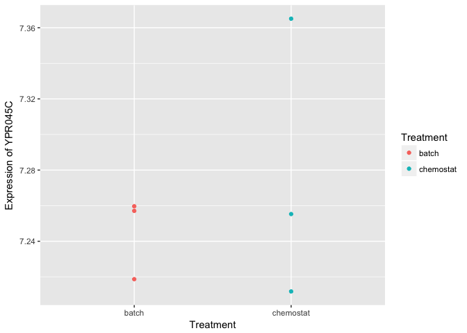
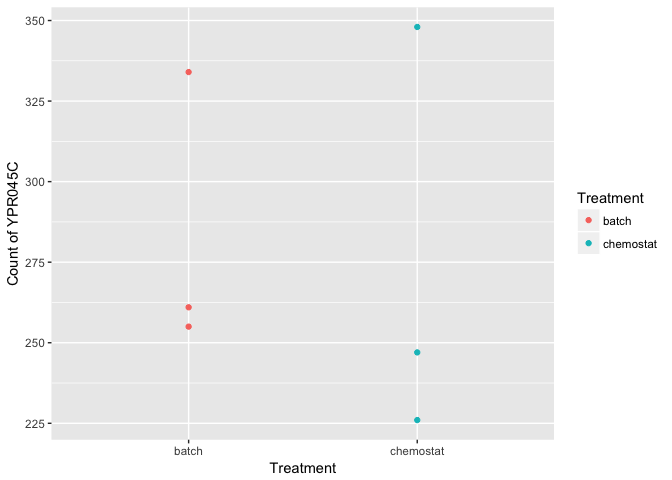

# Analysis assignment part II
Fangwu Wang  
2017-03-19  

```r
library(ggplot2)
library(pheatmap)
library(limma)
library(edgeR)
library(AnnotationDbi)
library("yeast2.db") 
```

## Question 6: Microarray analysis
#### 6.1 Data loading and QC

```r
read.delim(file="/Users/fangwu/Documents/R-git/assignment data/GSE37599-data.txt",sep="\t",row.names=1)->mdata
colnames(mdata)
```

```
## [1] "b1" "b2" "b3" "c1" "c2" "c3"
```

```r
str(mdata,max.level=0)
```

```
## 'data.frame':	10928 obs. of  6 variables:
```

The data contains 6 columns which indicate two treatment conditions (b1-b3: batch media; C1-3: chemostat). It has 10928 rows (genes/probe sets).  

To identify swapped samples:

```r
# 1. scatter plot matrix 
pairs(mdata)
```

<!-- -->

From the plots of each pair, b1 and c2 show low similarity with other samples within its group, which might be swapped.  

```r
# 2. heatmap of the first 100 genes
pheatmap(mat=mdata[1:100,],cluster_rows = T, cluster_cols = T, show_rownames = F, scale="row")
```

<!-- -->

Heatmap shows b1 and c2 might be swapped.  

```r
# 3. Pearson correlation shown in heatmap
c<-cor(mdata, y = NULL, use = "everything",method = c("pearson"))
pheatmap(mat=c,scale="none",cluster_cols = T, cluster_rows = T)
```

<!-- -->

Pearson correlation also shows b1 and c2 has lower correlation with their own group members but high correlation with samples in the other group.  

```r
# 4. PCA, plot the first two PC
# scale the transposed data across genes, and transpose back
mdata_scale<-t(scale(t(mdata)))
pca<-prcomp(x=mdata_scale, center = F, scale= F) # set false since data already scaled
plot(pca$rotation[,1:2],ylim = c(-0.7,0.6))
text(pca$rotation[,1],pca$rotation[,2],labels=rownames(pca$rotation),pos=1)
```

<!-- -->

PCA also supports that b1 and c2 are swapped. 

#### 6.2 Microarray DEA
Fix the label swap:  

```r
colnames(mdata)<-c("c2","b2","b3","c1","b1","c3")
```

Differential expression analysis with limma:  

```r
metadata<-data.frame(row.names = colnames(mdata),Treatment=c("chemostat","batch","batch","chemostat","batch","chemostat"))
metadata$Treatment<-relevel(metadata$Treatment, ref = "batch")
DesMat <- model.matrix(~ Treatment,data=metadata)
DataFit <- lmFit(mdata, DesMat)
EbFit<-eBayes(DataFit)
tableEbFIt<-toptable(EbFit,coef="Treatmentchemostat",number=Inf)
# convert probe id into gene id:
probe.id<-rownames(tableEbFIt)
gene.id <- unlist(mget(probe.id, yeast2ORF))
# Package these results in a data frame:
DEA<-data.frame(tableEbFIt,gene.id,rownames(tableEbFIt))
DEA<-DEA[,c(-5)]
head(DEA)
```

```
##                logFC         t      P.Value    adj.P.Val gene.id
## 1772391_at 10.111470 108.92958 9.477652e-14 1.035718e-09 YIL057C
## 1774122_at  8.473827  89.86550 4.277079e-13 2.336996e-09 YOR388C
## 1774070_at  8.990866  80.69881 9.932237e-13 3.617983e-09 YMR303C
## 1776153_at  7.304449  72.70264 2.248189e-12 5.717049e-09 YMR206W
## 1774072_at  8.577513  71.30964 2.615780e-12 5.717049e-09 YJR095W
## 1776304_at  8.081401  69.09726 3.347614e-12 5.881184e-09 YDR256C
##            rownames.tableEbFIt.
## 1772391_at           1772391_at
## 1774122_at           1774122_at
## 1774070_at           1774070_at
## 1776153_at           1776153_at
## 1774072_at           1774072_at
## 1776304_at           1776304_at
```

#### 6.3 Microarray DEA continue

```r
# Remove any rows with probes which don't map to genes:
DEA<-DEA[!is.na(DEA[,5]),]
str(tableEbFIt,max.level=0)
```

```
## 'data.frame':	10928 obs. of  5 variables:
```

```r
str(DEA,max.level = 0)
```

```
## 'data.frame':	5705 obs. of  6 variables:
```

We started with 10928 probesets and 5705 remained after removing the unmapped probes.  


```r
# The differential expression for the top hit:
DEA[1,]
```

```
##               logFC        t      P.Value    adj.P.Val gene.id
## 1772391_at 10.11147 108.9296 9.477652e-14 1.035718e-09 YIL057C
##            rownames.tableEbFIt.
## 1772391_at           1772391_at
```

The top hit is YIL057C gene, the expression of this gene under chemostat treatment is 2^(10.11) fold higher compared to batch medium treatment.  

```r
length(DEA[DEA[,4]<1e-5,4])
```

```
## [1] 725
```

725 probes are identified as differentially expressed at a false discovery rate (FDR) of 1e-5. 


```r
# Save the data.frame
write.table(DEA,file = "/Users/fangwu/Documents/R-git/assignment data/DEA.txt",quote = F,sep = "\t",row.names = T,col.names = NA)
```

## Question 7: RNA-seq analysis

#### 7.1 Load RNA Count Data and Sanity Check

```r
read.table(file="/Users/fangwu/Documents/R-git/assignment data/stampy.deep.counts.txt",header=T,row.names=1)->sdata
str(sdata,max.level=0)
```

```
## 'data.frame':	6542 obs. of  6 variables:
```

There are 6 columns in the data representing samples in two treatment groups (b1-b3: batch medium, c1-c3: chemostat) and there are 6542 rows which represent the identity of genes rather than probesets in the microarray data.  


```r
# check if there is mislabeling of samples:
sdatacorrelation<-cor(sdata, y = NULL, use = "everything",method = c("pearson"))
pheatmap(mat=sdatacorrelation,scale="none",cluster_cols = T, cluster_rows = T)
```

<!-- -->

There is no swapping of samples.  

#### 7.2 DEA of deep sequencing data  

```r
# Use EdgeR to analyze differential expression
metadata2<-data.frame(row.names = colnames(sdata),Treatment=c("batch","batch","batch","chemostat","chemostat","chemostat"))
metadata2$Treatment<-relevel(metadata2$Treatment, ref = "batch")
design <- model.matrix(~Treatment,metadata2)
```

Filtering: discard the genes which have total count<10 in all samples within the same group of both condition (b1-3 or c1-3), so that genes with total count>10 of either condition are retained.  

```r
sum1<-rowSums(sdata[,1:3])
sum2<-rowSums(sdata[,4:6])
sdata_sum<-data.frame(sdata, sum1, sum2)
sdata.fil<-sdata_sum[sdata_sum[,7]>10|sdata_sum[,8]>10,]
sdata.fil<-sdata.fil[,1:6]
str(sdata.fil,max.level=0)
```

```
## 'data.frame':	6161 obs. of  6 variables:
```

Number of genes: before filtering 6542; after filtering 6161.  

```r
dge.glm <- DGEList(counts=sdata.fil,group=metadata2$Treatment)
# Perform normalization
dge.glm.norm<- calcNormFactors(dge.glm)
# Estimate the dispersion
dge.glm.norm.disp <- estimateDisp(dge.glm.norm, design, verbose=TRUE)
plotBCV(dge.glm.norm.disp)
```

<!-- -->

```r
# Fit the generalized linear model
fit <- glmFit(dge.glm.norm.disp,design)
# Perform likelihood ratio test:
lrt <- glmLRT(fit,coef="Treatmentchemostat")
# Make a dataframe of toptags to identify differentially expressed genes:
toptags<-topTags(lrt,n=Inf)
tableglm<-edgeR::as.data.frame.TopTags(x = toptags)
head(tableglm)
```

```
##             logFC    logCPM       LR PValue FDR
## YIL057C 10.018775  8.214080 2238.345      0   0
## YMR175W  9.361490  7.954188 1730.963      0   0
## YJR095W  9.353868  7.754879 2337.746      0   0
## YMR107W  9.008409  8.736417 2786.724      0   0
## YKL217W  8.511228 11.390237 2153.678      0   0
## YPL201C  7.588703  7.046744 1855.783      0   0
```

```r
length(tableglm[tableglm[,5]<1e-5,5])
```

```
## [1] 2760
```

2760 genes are differentially expressed between conditions at a false discovery rate (FDR) of 1e-5.  


```r
# Save the dataframe:
edger.deep.results<-data.frame(tableglm,rownames(tableglm))
write.table(edger.deep.results,file = "/Users/fangwu/Documents/R-git/assignment data/edger.deep.results.txt",quote = F,sep = "\t",row.names = T,col.names = NA)
```

#### 7.3 DEA of low sequencing data


```r
# Load the low depth count data
read.table(file="/Users/fangwu/Documents/R-git/assignment data/stampy.low.counts.txt",header=T,row.names=1)->datalow
# Sanity check of sample swapping:
correlation<-cor(datalow, y = NULL, use = "everything",method = c("pearson"))
pheatmap(mat=correlation,scale="none",cluster_cols = T, cluster_rows = T)
```

<!-- -->

```r
# Filtering
sumlow1<-rowSums(datalow[,1:3])
sumlow2<-rowSums(datalow[,4:6])
datalow_sum<-data.frame(datalow, sumlow1, sumlow2)
datalow.fil<-datalow_sum[datalow_sum[,7]>10|datalow_sum[,8]>10,]
datalow.fil<-datalow.fil[,1:6]
str(datalow.fil,max.level=0)
```

```
## 'data.frame':	4523 obs. of  6 variables:
```

Number of genes: before filtering 7126; after filtering 4523.  


```r
# Normalization
dgelow.glm <- DGEList(counts=datalow.fil,group=metadata2$Treatment)
dgelow.glm.norm<- calcNormFactors(dgelow.glm)
# Dispersion
dgelow.glm.norm.disp <- estimateDisp(dgelow.glm.norm, design, verbose=TRUE)
plotBCV(dgelow.glm.norm.disp)
```

<!-- -->

```r
# Differential expression analysis
fit.l <- glmFit(dgelow.glm.norm.disp,design)
lrt.l <- glmLRT(fit.l,coef="Treatmentchemostat")
toptags.l<-topTags(lrt.l,n=Inf)
tableglm.l<-edgeR::as.data.frame.TopTags(x = toptags.l)
length(tableglm.l[tableglm.l[,5]<1e-5,5])
```

```
## [1] 492
```

492 genes are differentially expressed based on the low count data at a false discovery rate (FDR) of 1e-5.  

#### 7.4 Deep vs low sequencing

```r
deg_deep<-rownames(tableglm[tableglm[,5]<1e-5,])
deg_low<-rownames(tableglm.l[tableglm.l[,5]<1e-5,])
source("http://faculty.ucr.edu/~tgirke/Documents/R_BioCond/My_R_Scripts/vennDia.R")
qlist<-venndiagram(x=deg_deep, y=deg_low, unique=T, title="Deep vs Low Cov", labels=c("deep", "low") ,plot=T, lines=c(2,3), lcol=c(2,3), lwd=3, cex=1.3, type="2")
```

<!-- -->

492 genes were identified by edgeR in both low and deep count data. None gene was unique for low coverage data.  
2760 genes were identified in all the analyses.  

Low coverage data gives much fewer differential expression hits. All genes identified in the low count data are also identified in the high coverage data. This result indicates smaller number of reads result in lower confidence for calling differentialy expressed genes. 

## Question 8: Compare DEA results from RNA-Seq and arrays 
Compare the results of RNA-Seq DEA with those of the array DEA  

```r
# The overlap of differential genes between microarray and sequencing data:
array<-as.character(DEA[DEA[,4]<1e-5,5])
qlist2<-venndiagram(x=deg_deep, y=array, unique=T, title="sequencing vs microarray", labels=c("seq", "array") ,plot=T, lines=c(2,3), lcol=c(2,3), lwd=3, cex=1.3, type="2")
```

<!-- -->

```r
str(qlist2)
```

```
## List of 3
##  $ q1: chr [1:694] "YIL057C" "YMR175W" "YJR095W" "YMR107W" ...
##  $ q2: chr [1:2066] "YGR292W" "YPR160W" "YFR052C-A" "YPL275W" ...
##  $ q3: chr [1:29] "YIL169C" "YGL209W" "YKL071W" "YLR342W-A" ...
```

```r
# q1: common genes of microarray and sequencing data
# q2: only identified from sequencing data
# q3: only identified from microarray data
```

#### 8.1 Plots of interesting and boring genes
#### Interesting genes: identified as DE by both analyses

```r
geneid_all <- unlist(mget(rownames(mdata), yeast2ORF))
mdata2<-data.frame(mdata,geneid_all)
mdata2[,7]<-as.character(mdata2[,7])
# Define the functions:
microarrayplot<-function(gene)
  {geneexpr<-mdata2[which(mdata2[,7]==gene),]
geneexpr<-as.numeric(geneexpr[,1:6])
geneplot<-data.frame(metadata,geneexpr)
ggplot(geneplot, aes(x=Treatment,y=geneexpr,color=Treatment)) + geom_point()+ylab(paste("Expression of",gene))}
sequencingplot<-function(gene)
{genecount<-sdata[rownames(sdata)==gene,]
genecount<-as.integer(genecount)
geneplot2<-data.frame(metadata2,genecount)
ggplot(geneplot2, aes(x=Treatment,y=genecount,color=Treatment)) + geom_point() +ylab(paste("Count of",gene))}
# pick a random gene from the interesting list
gene<-sample(qlist2$q1,1)
gene
```

```
## [1] "YLR438W"
```

```r
# Plot the expression of the interesting gene:
microarrayplot(gene)
```

<!-- -->

```r
sequencingplot(gene)
```

<!-- -->

```r
# pick another gene from the interesting gene list:
gene<-sample(qlist2$q1,1)
gene
```

```
## [1] "YMR018W"
```

```r
microarrayplot(gene)
```

<!-- -->

```r
sequencingplot(gene)
```

<!-- -->


#### Identified as DE only in the array analysis

```r
gene<-sample(qlist2$q3,1)
gene
```

```
## [1] "YCR087C-A"
```

```r
microarrayplot(gene)
```

<!-- -->

```r
sequencingplot(gene)
```

```
## Warning: Removed 6 rows containing missing values (geom_point).
```

<!-- -->

#### Identified as DE only in the sequencing analysis

```r
gene<-sample(qlist2$q2,1)
gene
```

```
## [1] "YAR003W"
```

```r
microarrayplot(gene)
```

<!-- -->

```r
sequencingplot(gene)
```

<!-- -->

#### Boring gene:

```r
ndeg_deep<-rownames(tableglm[tableglm[,5]>1e-5,])
narray<-as.character(DEA[DEA[,4]>1e-5,5])
boring<-intersect(ndeg_deep,narray)
gene<-sample(boring,1)
gene
```

```
## [1] "YPR045C"
```

```r
microarrayplot(gene)
```

<!-- -->

```r
sequencingplot(gene)
```

<!-- -->

## Question 9 (OPTIONAL): Try another package
#### 9.1 DEA with voom+limma on deep seq data


```r
# calculate norm factor:
dge.norm <- calcNormFactors(dge.glm) # filtered data from 7.2
# voom transformation on normalized dge:
dge.voom <- voom(dge.norm, design, plot=TRUE)
```

<!-- -->

```r
# convert to logCPM values:
logCPM <- cpm(dge.voom, log=TRUE, prior.count=3)
# fit into a linear model:
fit <- lmFit(logCPM, design)
fit <- eBayes(fit)
tablevoom<-topTable(fit, coef=2,number = Inf)
length(tablevoom[tablevoom[,5]<1e-5,5])
```

```
## [1] 5
```

```r
voomlist<-rownames(tablevoom[tablevoom[,5]<1e-05,])
intersect(deg_deep,voomlist)
```

```
## [1] "YJR095W" "YAL054C" "YDR256C" "YKR009C" "YAL062W"
```
Two genes are overlapped between the two methods.

