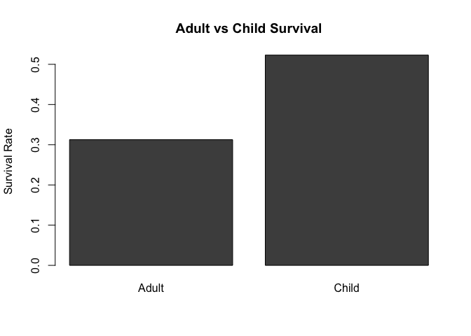
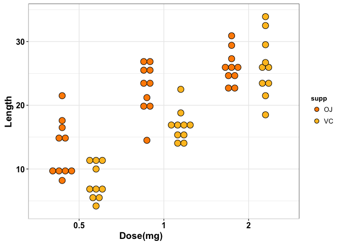

# Practice Assignment
Fangwu Wang  
2017-01-14  

## I. Data inspection with R: Titanic

1. Convert the array into a data frame:


```r
titanic<-data.frame(Titanic) # create a dataframe object 
```

2. Passenger breakdown: 

2.1 How many children and adults were on Titanic?


```r
nchi<-sum(titanic[titanic[,3]=="Child",5]) # calculate the total number of children 
nadu<-sum(titanic[titanic[,3]=="Adult",5]) # calculate the total number of adults
```

Conclusion: There were 109 children and 2092 adults on Titanic.


2.2 Were there more female or male adult passengers?


```r
adult<-titanic[titanic[,3]=="Adult",] # subset of adult passengers
nma<-sum(adult[adult[,2]=="Male",5]) # calculate the number of male adult passengers
nfe<-sum(adult[adult[,2]=="Female",5]) # calculate the number of female adult passengers
x<-ifelse(nma<nfe, "female", "male") # determine which group is larger
```

Conclusion: There were more male adult passengers.


3. Survival: creating a barplot for survival rates.

3.1 Comparing the survival rates between children and adults:


```r
child<-titanic[titanic[,3]=="Child",] # subset of child passengers
radu<-sum(adult[adult[,4]=="Yes",5])/sum(adult[,5]) # calculate survival rate of adult passengers
rchi<-sum(child[child[,4]=="Yes",5])/sum(child[,5]) # calculate survival rate of child passengers
m1<-matrix(data=c(radu, rchi), nrow=1, ncol=2) # create a matrix
colnames(m1)<-c("Adult", "Child")
barplot(height=m1,main = "Adult vs Child Survival", ylab="Survival Rate") # create a barplot
```

<!-- -->

```r
x2<-ifelse(rchi>radu,"did","did not") # determine which group has higher survival rate
```

Conclusion: Children did have a better survival rate than adults.


3.2 Comparing the survival rates between different classes:


```r
# subsets of different classes
First<-titanic[titanic[,1]=="1st",] 
Sec<-titanic[titanic[,1]=="2nd",]
Thi<-titanic[titanic[,1]=="3rd",]
Cre<-titanic[titanic[,1]=="Crew",]

#calculate the survival rates of different classes
rF<-sum(First[First[,4]=="Yes",5])/sum(First[,5])
rSec<-sum(Sec[Sec[,4]=="Yes",5])/sum(Sec[,5])
rThi<-sum(Thi[Thi[,4]=="Yes",5])/sum(Thi[,5])
rCre<-sum(Cre[Cre[,4]=="Yes",5])/sum(Cre[,5])

# create a matrix
m2<-matrix(data=c(rF, rSec, rThi, rCre), nrow=1, ncol=4)
colnames(m2)<-c("1st", "2nd","3rd","Crew")

# barplot
barplot(height=m2,main = "Survival-Classes", ylab="Survival Rate")
```

<!-- -->

```r
# convert data to data.frame
d2<-as.data.frame(m2)

# determine which class has the highest survival rate
x3<-names(which.max(d2))
```

Conclusion: 1st class of passengers have a better survival rate.


## II. Data visualization: ToothGrowth

Data description: The response is the length of odontoblasts (cells responsible for tooth growth) in 60 guinea pigs. Each animal received one of three dose levels of vitamin C (0.5, 1, and 2 mg/day) by one of two delivery methods, (orange juice or ascorbic acid (a form of vitamin C and coded as VC).


```r
table<-read.table(file="/Users/fangwu/Documents/R-git/zz_wang-fangwu_STAT540_2017/Practice Assignment/guinea_pigs_tooth_growth.txt", header = T) # read the data

class(table) # class of the data
```

```
## [1] "data.frame"
```


Create a dot plot using easyGgplot2 package (pre-installed) - ggplot2.dotplot function


```r
library(easyGgplot2)
ggplot2.dotplot(data=table, xName='dose',yName='len', groupName='supp',
position=position_dodge(0.8), xtitle="Dose(mg)", ytitle="Length", 
backgroundColor="white",groupColors=c("darkorange", "goldenrod1")
)  # create dotplot
```

<!-- -->

This dotplot shows the length of tooth in individual dots in response to different dosages of two methods of supplementation. The length of tooth growth
was higher with increasing dosages for both orangejuice and Vitamin C treatment. OJ supplementation enhanced tooth growth more than VC at dose 0.5mg, 1mg, and has similar effect with VC at dose 2mg.

This graph was choosen because it showed all the information given by the dataset, clearly presenting the variation and values of the variables. The effects of dosages and supplementation could be easily visualized.


